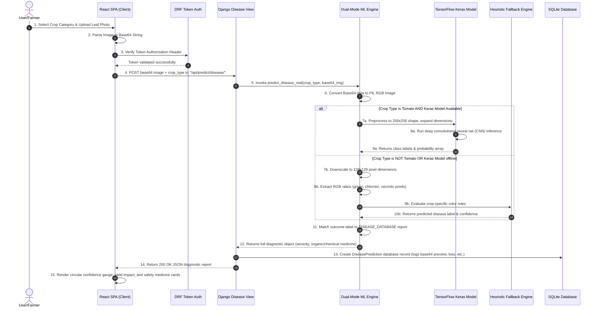
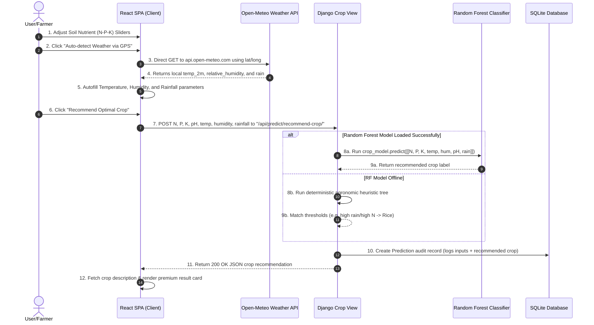

# AgroVision AI - Technical Architecture & Processing Pipeline

This document details the **Tech Stack**, **Inference Pipelines**, and **Execution Flow** of the AgroVision AI system. It is structured to be directly integrated into your project thesis, report, or presentation slides.

---

## 💻 Tech Stack Summary

The project utilizes a decoupled, high-performance web architecture consisting of an active React Single Page Application (SPA) communicating over a secure JSON API with a Django REST API.

| Layer | Technology | Role & Details |
| :--- | :--- | :--- |
| **Frontend UI** | **React 19 (Vite SPA)** | High-speed, responsive, interactive single-page canvas. |
| **Styling** | **Tailwind CSS v4** | Custom-themed utility engine providing advanced glassmorphism grids. |
| **Icons** | **Lucide React** | Lightweight, high-quality, modern stroke vectors. |
| **Backend Core** | **Django 5.0** | Secure, structured Python application framework. |
| **Web REST API** | **Django REST Framework (DRF)** | Standardized HTTP REST controllers with serializing capabilities. |
| **Authentication** | **DRF TokenAuthentication** | Secure database-backed unique session keys (`Authorization: Token <key>`). |
| **Deep Learning** | **TensorFlow 2.16 & Keras** | Primary deep neural network image inference (Tomato leaf classifier). |
| **Machine Learning** | **Scikit-Learn (Random Forest)** | Soil nutrient N-P-K recommendation engine. |
| **Image Handling** | **Pillow (PIL)** | In-memory base64 image parsing, resizing, and color-space conversion. |
| **External API** | **Open-Meteo Weather API** | Key-free real-time global coordinate climate queries. |
| **Database** | **SQLite 3** | Lightweight relational database containing structured agricultural audit logs. |

---

## 🔄 Step-by-Step Processing Pipeline

Below is the execution flow from the moment the user interacts with the application to the final rendering of reports and charts.

### 🍃 Pipeline A: Leaf Disease Diagnosis (Image Analysis)

---

### 🧪 Pipeline B: Soil-Based Crop Recommendation

---

### 📊 Pipeline C: Historical Dashboard & Custom SVG Charting

1.  **Request Logs**: Client queries `/api/history/` and `/api/history/stats/` on tab navigation.
2.  **Database Query**: Django filters `DiseasePrediction.objects.filter(user=request.user)`.
3.  **Aggregate Analytics**: Django counts total uploads, active outbreaks, average diagnostic confidence, and groups them by crop type.
4.  **JSON Payload**: Backend returns clean structured statistical arrays.
5.  **Rendering Custom SVG Canvases**:
    *   **Outbreak Distribution (Bar Chart)**: Client reads data values and maps them dynamically to SVG `<rect>` shapes with custom linear color gradients (`#10B981` to `#059669`).
    *   **30-Day Trends (Area Chart)**: Client maps chronological records into responsive SVG path lines using quadratic curve formatting (`M... Q... C...`) and fills the lower region with a translucent gradient overlay.
